# AstroFixxer Beta Tester Guide

Updated 2 October 2026. A Word copy with the same pictures is in [AstroFixxer-Beta-Tester-Guide.docx](AstroFixxer-Beta-Tester-Guide.docx).

AstroFixxer turns an Android phone strapped to a manual telescope into a push-to finder: line up on one bright star, then follow the arrows to anything else. This guide takes you from an empty box to your first target, with pictures of every screen.

## Before you start

You need four things: an Android phone, a manual telescope, a way to fix the phone to it, and a clear night.

| What | Details |
| --- | --- |
| Android phone | Android 8 or newer, with a compass and gyroscope. A phone without a compass still works: you fix the direction by dragging the map once. |
| Telescope | Any manual telescope: a Dobsonian, a small alt-azimuth mount, or an equatorial mount moved by hand. No motors or encoders needed. |
| Phone holder | A smartphone adapter that clamps to the eyepiece, or a holder or strap that fixes the phone to the tube. It must not slip when you move the telescope. |
| At the site | A dark spot, a red torch, and time for your eyes to adjust (about 20 minutes). The app has a red night mode. |

> **Never point a telescope at the Sun without a certified solar filter fixed over the front. The app can be wrong, and it is not a solar safety tool.** It refuses the Sun as an alignment star, but it cannot see where your telescope is really aimed. Looking at the Sun through unfiltered optics can blind you in a moment, and it does not hurt while it happens.

**What "beta" means here.** Everything in this guide has passed automated tests and a screen-by-screen check on a computer. None of it has been tried under a real sky yet: real phone sensors, the camera, real star photos and the updater are exactly what you are testing. Expect some rough edges, and please tell us about them (see the last section).

## Download and install safely

The beta is an APK file from the project's own GitHub page, not from the Play Store. Android is careful with apps from outside the store, so you will see two or three warnings. They are normal for any app installed this way; below is what each one means and what to tap. Wording differs a little between phone brands.

**Only ever download from this one address:** [github.com/Zenithquonta/astrofixxer-android/releases/download/latest-build/AstroFixxer.apk](https://github.com/Zenithquonta/astrofixxer-android/releases/download/latest-build/AstroFixxer.apk). Never install a copy someone sends you in a chat or from another website.

### Step by step

| Step | What you see | What it means | What to do |
| --- | --- | --- | --- |
| 1. Download | The browser says "This type of file can harm your device" or "File might be harmful" | Browsers say this about every APK, whatever is inside | Check the address starts with github.com/Zenithquonta, then tap **Download anyway** |
| 2. Open the file | Tap the download in the notification, or open **Files → Downloads → AstroFixxer.apk** |  |  |
| 3. Unknown apps | "For your security, your phone is not allowed to install unknown apps from this source" | Android blocks installs from the browser until you allow it, once | Tap **Settings**, turn on **Allow from this source**, then press Back |
| 4. Samsung only | Install is blocked by **Auto Blocker** | Samsung's extra protection blocks every app from outside the stores | **Settings → Security and privacy → Auto Blocker**, turn it off for the install, then back on |
| 5. Install | "Do you want to install this app?" | The normal install screen | Tap **Install** |
| 6. Play Protect | "Unsafe app blocked", "App scan recommended" or "Send app for a security scan?" | Google has not seen this app before because it is not on the Play Store | Tap **Scan app** (Google checks it), or **More details → Install anyway** |
| 7. Done | "App installed" |  | Tap **Open** |

Afterwards you can turn **Allow from this source** off again for your browser (**Settings → Apps → Special app access → Install unknown apps**). It is only needed while installing.

### Permissions the app asks for

| Permission | When it asks | Why | If you say no |
| --- | --- | --- | --- |
| Approximate location | First launch | To draw the sky for where you are | Type your location by hand in **Place & time** |
| Microphone | Only when you tap **Ask** | Voice questions, turned into text by your phone's speech service | Everything else works |
| Camera | Only when you open the camera live view | Photos of the stars for camera solving; never saved or sent | Use a gallery photo, or skip camera solving |
| Install apps (GitHub download only) | Only when you tap **Download and install** for an update | To hand the update to Android's installer | Update by downloading the APK again |

The app asks for nothing else: no contacts, no files, no precise location, no account.

### Updating

| App updates panel |
| :-: |
| 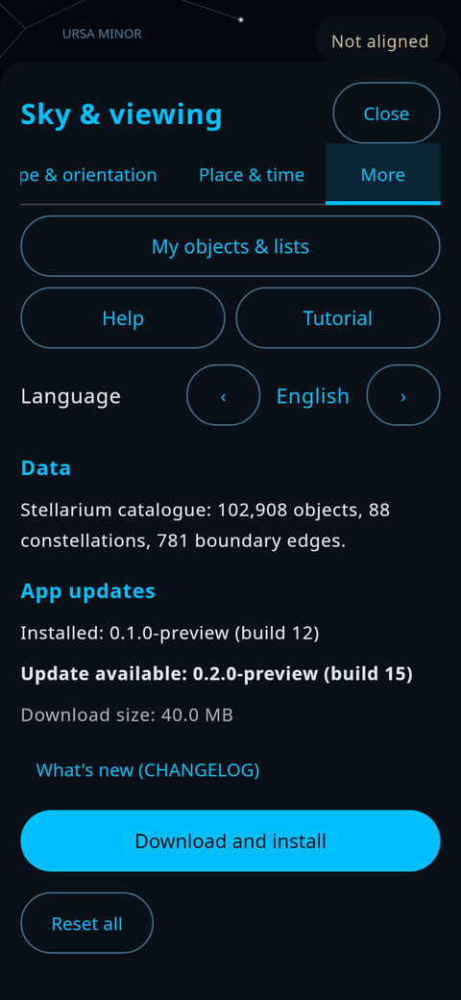 |

Open **Sky & viewing → More → App updates → Check for updates**. If there is a newer build, the app shows what changed, downloads it, checks its size and SHA-256 fingerprint against the release, and then Android asks you to confirm. It never checks or downloads on its own.

**Important for this beta:** until the project's permanent signing key is in place, each new build is signed with a new, temporary key. Android will then refuse to install it over the old one ("App not installed" or "package conflicts"). The app warns you about this before downloading. The fix is to uninstall AstroFixxer and install the new APK, which erases your saved lists and settings.

### Check the file yourself (optional)

Every build publishes a SHA-256 fingerprint of the APK next to it, in **update.json** on the [release page](https://github.com/Zenithquonta/astrofixxer-android/releases/tag/latest-build). If the fingerprint of your download matches, the file is exactly the one the build machine produced.

| On | Command |
| --- | --- |
| Windows | `certutil -hashfile AstroFixxer.apk SHA256` |
| macOS | `shasum -a 256 AstroFixxer.apk` |
| Linux | `sha256sum AstroFixxer.apk` |

The build of 2 Oct 2026 (version 0.1.0-preview, build 1045, 10.0 MB) has the fingerprint `a43fe82fc12337fc27d590289454898c09e08a94558de6ac41e990d4f1690a9e`. Newer builds have different fingerprints; always compare against the update.json published with the file you downloaded.

You can also upload the APK to [virustotal.com](https://www.virustotal.com), which scans it with about 70 antivirus engines.

### If something goes wrong

| Message | Fix |
| --- | --- |
| "App not installed" or "package conflicts with an existing package" | Uninstall the old AstroFixxer first (this erases your lists), then install again |
| "There was a problem parsing the package" | The download was cut short. Delete it and download again on a steady connection |
| "App not installed as package appears to be invalid" | Your Android is older than 8.0. The app needs Android 8 or newer |
| The install button is greyed out | Close any app drawing over the screen (screen dimmers, chat bubbles), then try again |
| Nothing happens when you tap the file | Open it from **Files → Downloads** instead of the browser |

## Security evidence

Every build you can download has passed the automated checks below, and you can see each result yourself. The build behind the 2 Oct 2026 download (commit `03ecfc2`) passed all three check jobs in [build run 45](https://github.com/Zenithquonta/astrofixxer-android/actions/runs/36947220805). All runs are listed on the [Actions page](https://github.com/Zenithquonta/astrofixxer-android/actions).

| Check | What it proves | Runs |
| --- | --- | --- |
| Open source | All code is public under GPLv3 at [github.com/Zenithquonta/astrofixxer-android](https://github.com/Zenithquonta/astrofixxer-android); anyone can read what the app does | Always |
| Secret scan (gitleaks) | No password, key or token has ever been committed, across the whole history. The scanner itself is pinned and checksum-verified | Every push |
| Unit tests (about 150) | The astronomy, the plate solver and the updater's safety rules behave as designed, including refusing fake or oversized update files | Every push |
| Screen tests and audit | 120 UI tests drive the real screens; an audit checks 492 screen variants for touch targets of at least 48 dp, no cut-off or overlapping text, and readable contrast | Every push |
| APK integrity | The APK's signature is valid, and its version, app ID, size and SHA-256 match the published update.json; any mismatch fails the build | Every push |
| Store build check | The Play Store version cannot install other apps; the build fails if it asks for that permission | Every push |
| Minimal permissions | Only approximate location, microphone, camera and internet (plus install-apps in the GitHub download, for updates) | Fixed in the code |
| Privacy by design | No accounts, ads, analytics or trackers. The only network requests are the space-station orbit file (at most once a day) and the update check (only when you tap). Photos and audio are never stored | See [PRIVACY.md](https://github.com/Zenithquonta/astrofixxer-android/blob/main/PRIVACY.md) |
| Safe updates | HTTPS only, files only from this project's own GitHub release, size limits, SHA-256 check before install, and Android's installer always asks you | See [SECURITY.md](https://github.com/Zenithquonta/astrofixxer-android/blob/main/SECURITY.md) |

What has **not** been done yet, so you know exactly where things stand:

- **No independent security audit.** The checks above are the project's own automated tests, not a review by an outside firm.
- **Not reviewed by Google Play.** That is why Play Protect may warn you (step 6 above).
- **No permanent signing key yet for the GitHub download.** The 2 Oct build is signed with a temporary key (certificate "Android Debug", SHA-256 `48d2b1f2af9e305837fccbe3358ac6a4f1b22a83cc33227073daa235e4f54387`), which is why updates need an uninstall for now. This changes once the maintainer adds the permanent key.
- **Not yet tried on real phones under a real sky.** That is what this beta is for.

Found a security problem? Please tell the maintainer privately (the person who invited you to the beta), not in a public issue. Once enabled, the repository's **Security → Report a vulnerability** page will also take private reports.

## Know your telescope

The app needs to know one thing about your optics: where the eyepiece sits. That decides which way the phone points when it is fixed to the eyepiece.

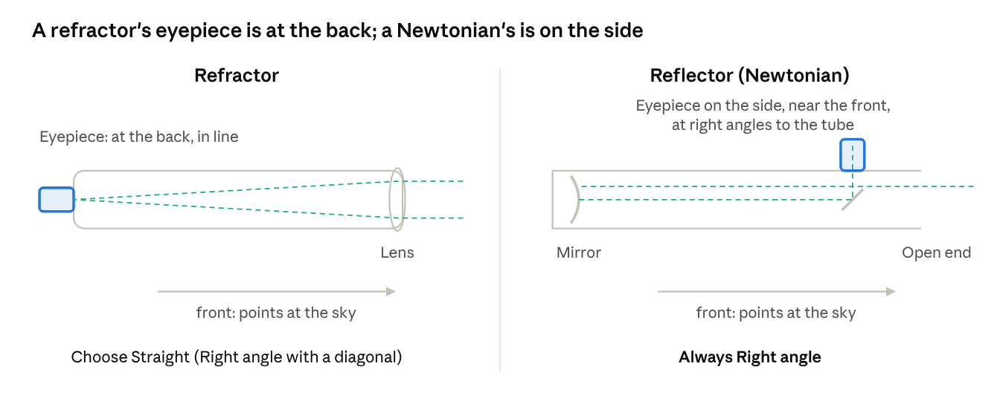

Light (dashed) enters at the front. In a refractor it goes straight through to the eyepiece at the back. In a Newtonian it bounces off the mirror at the bottom and a small flat mirror sends it out of the side.

| Type | How to recognise it | Where the eyepiece sits | What to choose in the app |
| --- | --- | --- | --- |
| Refractor | A lens at the front, a long thin tube | At the back, in line with the tube | **Straight**. If you use a star diagonal (the eyepiece points up at 90°), choose **Right angle**. |
| Reflector (Newtonian), including most Dobsonians | Open at the front, a big mirror at the bottom | On the side, near the front, at right angles to the tube | **Right angle**, always. Newer builds choose it for you and only ask which phone edge faces the front. |
| Something else (Maksutov, Schmidt-Cassegrain) | A short, fat tube, closed at the front | At the back, usually with a star diagonal | **Right angle** with a diagonal, **Straight** without one. Not sure? Choose **Not sure** and check it later with two stars. |

The **front** of the telescope is always the end that points at the sky.

## Mount the phone

There are three ways to fix the phone, and the app works with all of them. Pick the one your holder allows; the eyepiece mount is the only one that lets you see through the telescope on the screen.

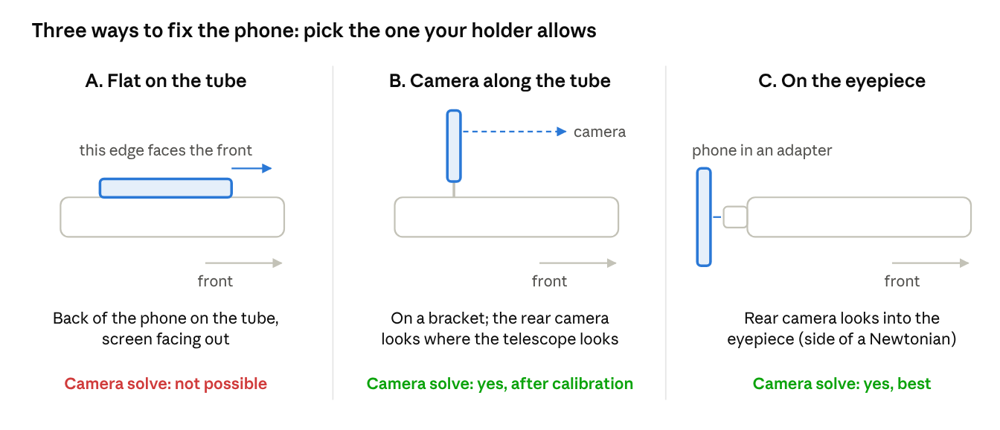

On a Newtonian, placement C means the phone sits on the side of the tube, looking into the side eyepiece; the app then asks which phone edge points toward the front.

| Placement | How to fit it | The app asks | Camera solving |
| --- | --- | --- | --- |
| **A. Flat on the tube** | Strap or clamp the phone with its back on the tube, screen facing out. Line its long edge up with the tube. | Which edge of the phone points toward the front of the telescope | Not possible: the camera faces the tube |
| **B. Camera along the tube** | Fix the phone on a bracket or finder shoe so the rear camera looks the same way as the telescope. | Nothing more | Yes, after a one-time offset calibration |
| **C. On the eyepiece** | Clamp the phone in a smartphone eyepiece adapter so the rear camera looks straight into the eyepiece. Centre the bright circle on the screen. | Straight or right-angle eyepiece; for a right angle, which phone edge faces the front | Yes, the best option |

Tips that save a night:

- **Rigid beats neat.** If the phone shifts in its holder, every direction after that is wrong. Tighten it, then nudge the tube and check the phone did not move.
- **Keep magnets away.** Many phone holders and cases have magnets, and they upset the compass. A metal tube does too. Aligning on a star near your target fixes most of it.
- **Screen towards you.** You will read the arrows while moving the telescope.
- **Check once after fitting.** In **Sky & viewing → Telescope & orientation**, tap **Check orientation → Check the phone position**. Two stars tell you if the edge you chose is right.
- **Moved the phone? Align again.** Changing how the phone sits clears the old alignment, and the app tells you so.

## First launch: the setup wizard

The first time you open AstroFixxer, a short wizard asks how your telescope and phone are set up. It takes under a minute and has at most six steps.

| 1. Telescope type | 2. Mount | 3. Phone placement | Last. Summary |
| :-: | :-: | :-: | :-: |
| 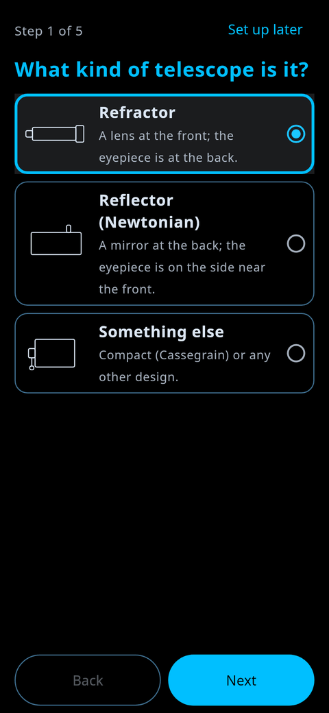 | 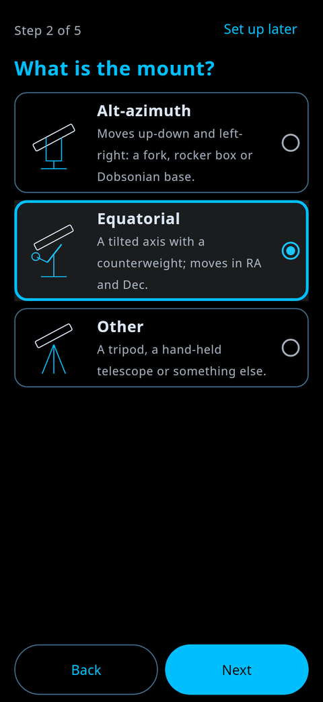 | 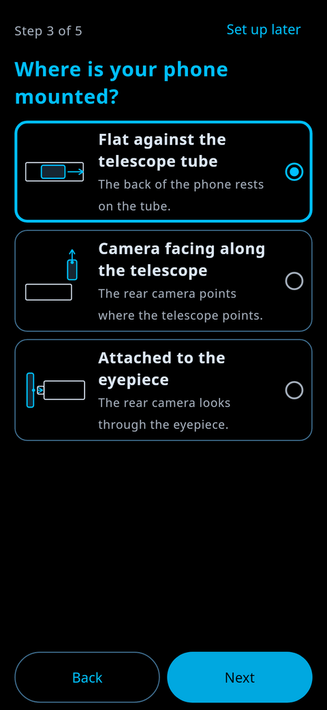 | 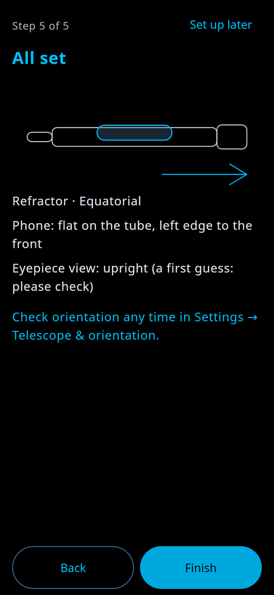 |

1. **Telescope type.** Refractor, Reflector (Newtonian) or Something else. See *Know your telescope* above.
2. **Mount.** Alt-azimuth (up-down and left-right, including Dobsonian bases), Equatorial (a tilted axis with a counterweight; guidance then uses RA and Dec), or Other.
3. **Phone placement.** Flat on the tube, camera along the telescope, or on the eyepiece. See *Mount the phone* above.
4. **Follow-ups.** Only what your placement needs: which phone edge faces the front, and for an eyepiece whether it is straight or right-angle and whether it has an erecting prism.
5. **Summary.** Check it and tap **Finish**.

Not ready? **Set up later** keeps the defaults. You can change everything later in **Sky & viewing → Telescope & orientation**, where you also enter the telescope and eyepiece focal lengths so the eyepiece circle on the map matches your real view.

## Align on a star

Alignment tells the app where your telescope really points, so the map and the arrows agree with the sky. Do it at the start of every session and again for each new target, because phone sensors drift over a few minutes.

| 1. Tap a star | 2. Centre it | 3. Drag the map | 4. Aligned |
| :-: | :-: | :-: | :-: |
| 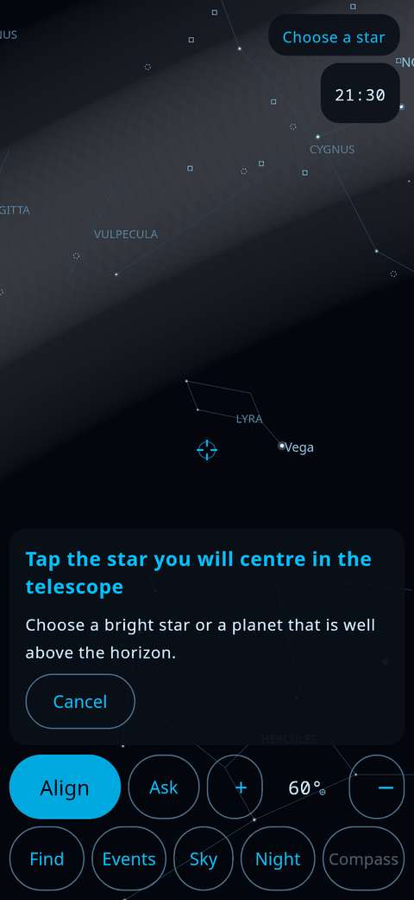 | 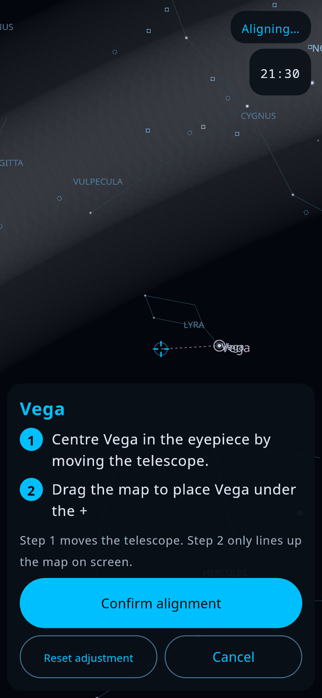 | 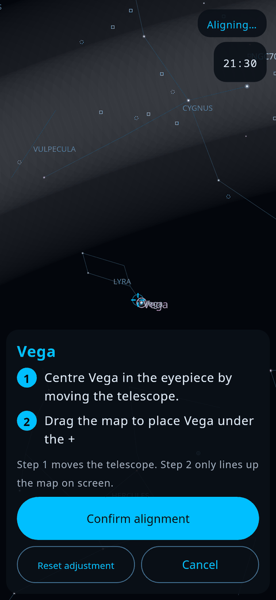 | 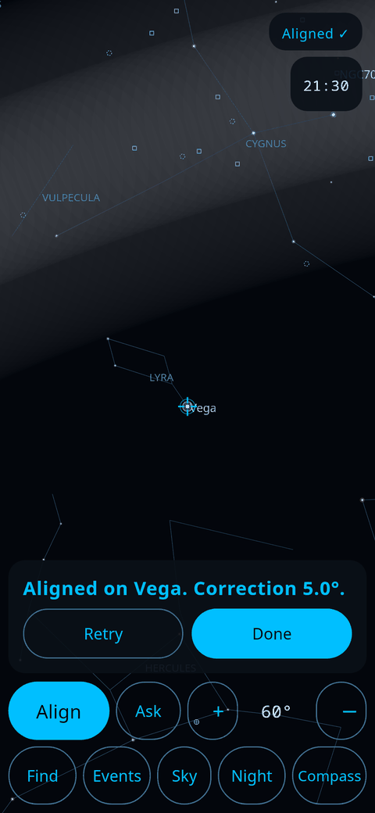 |

1. Tap **Align**, then tap a bright star, a planet, the Moon or any other object you can centre, well above the horizon. Good first choices: Vega, Arcturus, Capella, Sirius, Jupiter. (You can also press and hold an object and choose **Align on this object**.)
2. **Move the telescope** until that star sits in the middle of the eyepiece. Use your lowest-power eyepiece; it is much easier.
3. **Drag the map** with your finger until the same star is under the **+** in the middle of the screen. This only lines up the map on screen; it never moves the telescope.
4. Tap **Confirm alignment**. The card says how big the correction was. **Retry** repeats the same star; **Reset adjustment** undoes your dragging.

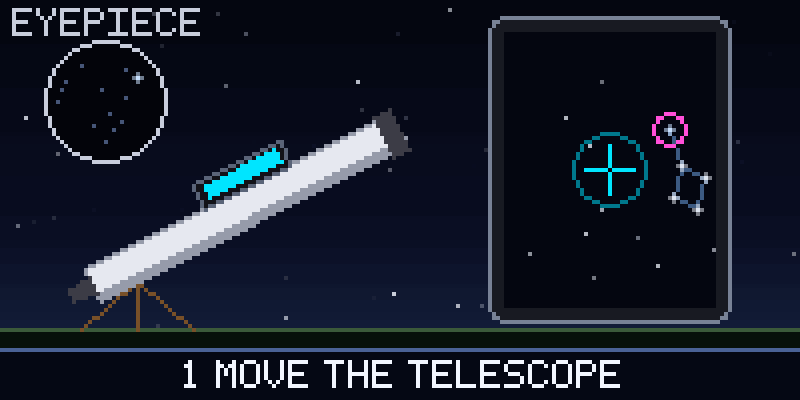

- **A big correction** (the app warns you) usually means the wrong star was centred. Check the star in the eyepiece is the one you tapped.
- **No compass on your phone?** Step 3 also sets the starting direction, so it still works.
- **Want to check it?** In the guidance panel tap **More → Check with another star**. The app says how far off the alignment was and refines it using both stars.
- The app will not let you align on the Sun, or on anything within 15° of it while the Sun is up (Venus or the Moon by day). For a big object such as the Moon, centre its middle.

## Find a target

Once aligned, pick a target and follow one big arrow until it turns into a filled bullseye.

| Follow the arrow | Close | On target |
| :-: | :-: | :-: |
| 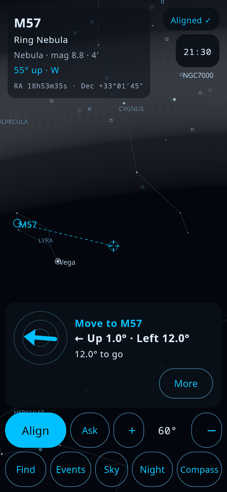 | 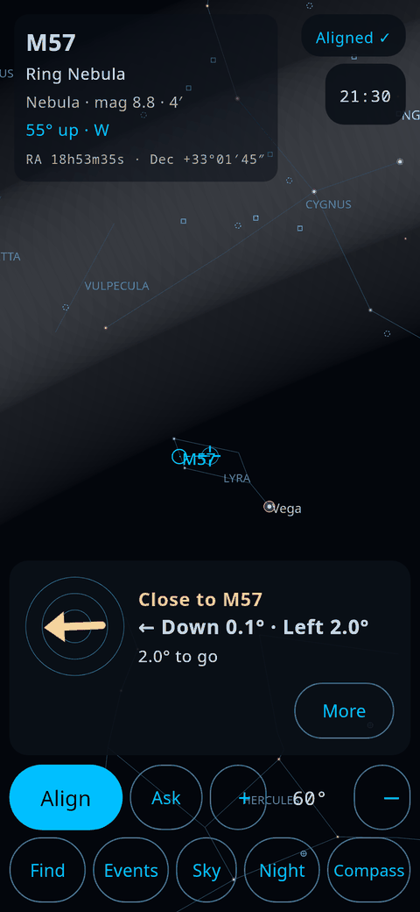 | 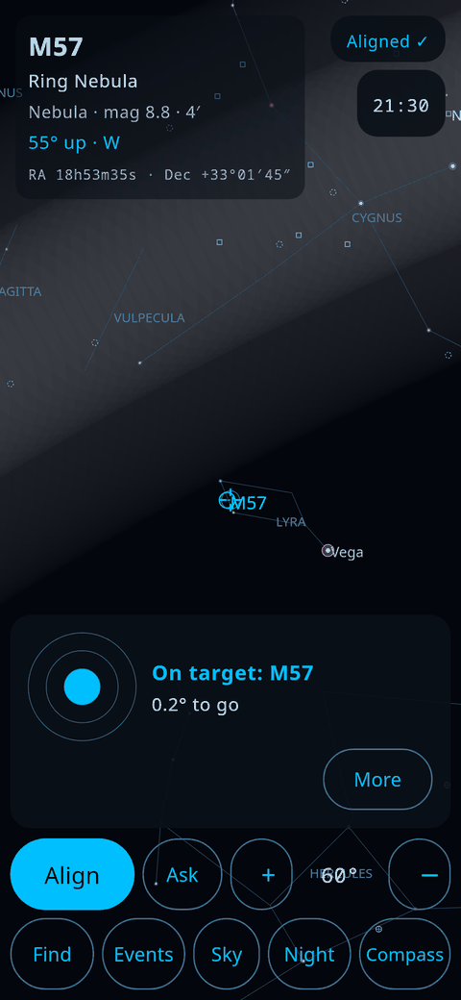 |

1. Tap **Find** and search for a target, for example **M57** (the Ring Nebula), or tap any object on the map. Press and hold an object for its info: rise and set times and how high it is tonight.
2. Move the telescope the way the arrow points. The words say the same thing in degrees: up or down, left or right, and the distance left.
3. The arrow turns **amber** when you are close, and a **filled bullseye** means the target is inside your eyepiece's field.
4. Look through the eyepiece. Faint objects need dark skies and a few seconds of looking slightly to the side.

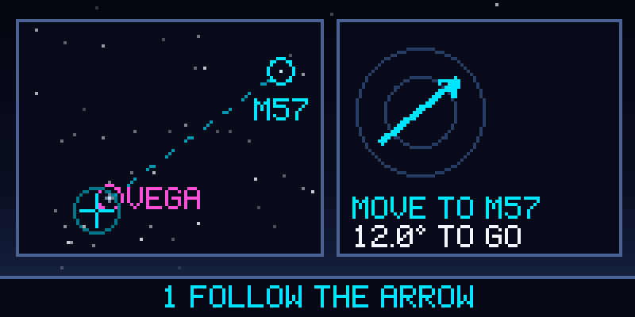

- **Re-align for each new target**, on a bright star near it. Phone sensors drift.
- On an **equatorial** mount the directions are in RA and Dec instead of up/down and left/right.
- **More** shows the exact numbers, **Check with another star**, and controls to turn or mirror the map to match your eyepiece.
- **Compass** and **Free look**: Compass follows the phone's sensors. Free look ignores them and lets you drag the sky like a planetarium, handy for planning.

## Check the eyepiece view

Most telescopes show the sky upside down, mirrored or turned, so "up" in the eyepiece may not be "up" on the map. Two quick checks fix that, once after fitting the phone or whenever directions feel wrong.

| Two checks | Nudge and answer | Result |
| :-: | :-: | :-: |
| 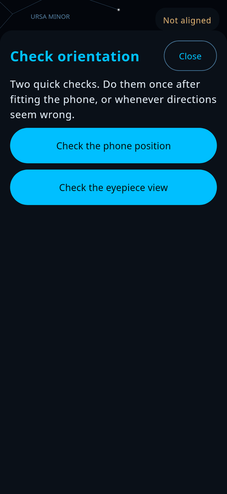 | 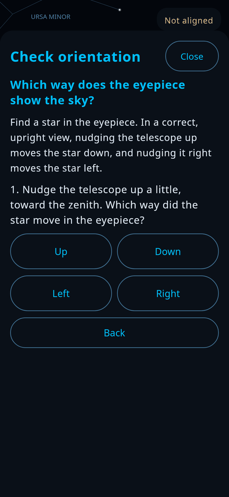 | 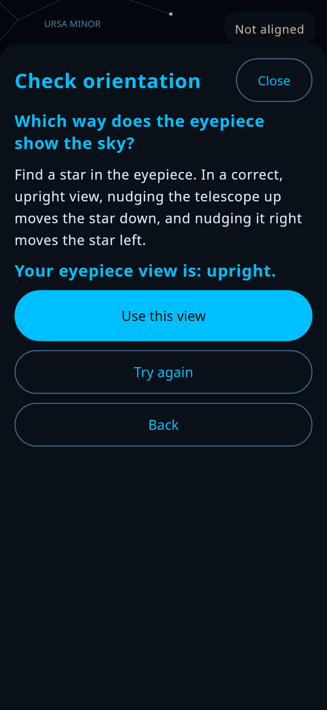 |

Open **Sky & viewing → Telescope & orientation → Check orientation**.

- **Check the phone position** uses two alignment stars to confirm which phone edge really points along the telescope. If the setting is wrong, it offers the right one.
- **Check the eyepiece view**: put a star in the eyepiece, nudge the telescope up a little, and tap which way the star moved. Then nudge it right and answer again. The app works out whether your view is upright, rotated or mirrored. Tap **Use this view**.

After that, **Match eyepiece view** turns the map to look like your eyepiece. **Rotate view 90°** and **Mirror view** under **More** do it by hand. The guidance words (up, left) always mean the direction to move the telescope, whatever the map shows.

Typical results: a straight-through refractor shows the sky turned 180°; a star diagonal shows it mirrored; a Newtonian is turned by an amount that depends on where its eyepiece sits, so check it.

## Align with a photo (camera solve)

Instead of trusting the compass, the phone can take a photo of the stars and work out exactly where the telescope points. It runs on the phone, offline, and usually takes a few seconds.

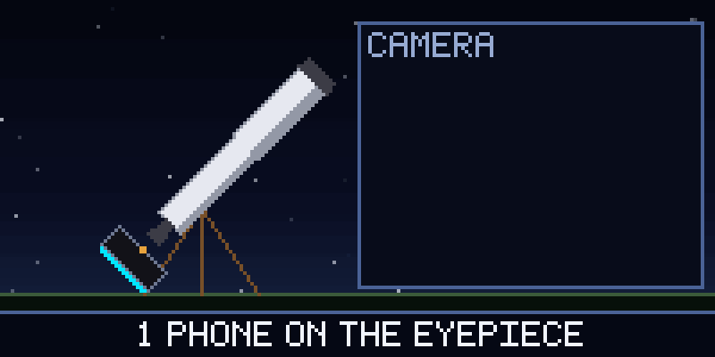

| Arrangement | Live view | Solved | Aligned |
| :-: | :-: | :-: | :-: |
| 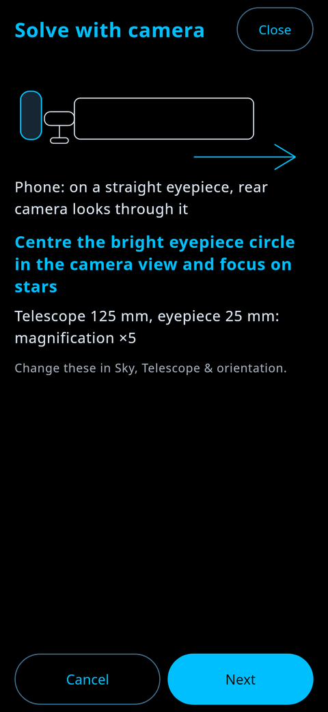 | 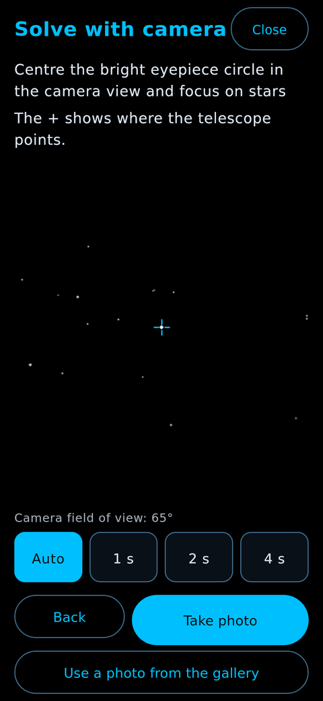 | 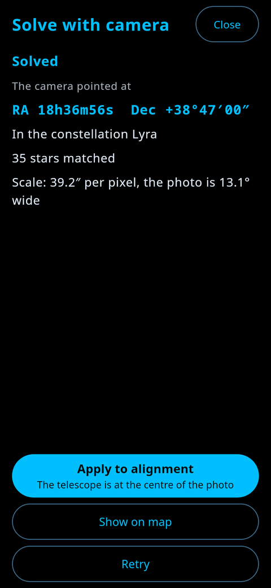 | 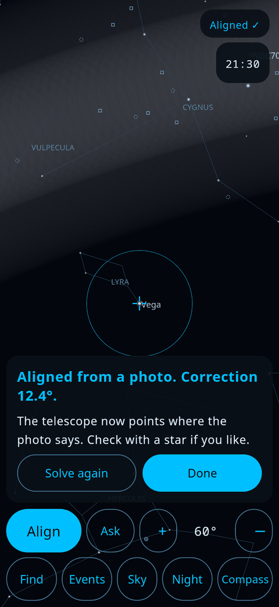 |

1. Open it from the alignment panel (**Align with a photo**) or from **Sky & viewing → Telescope & orientation → Solve with camera**.
2. Check the arrangement screen: it shows how the phone sits and your telescope and eyepiece focal lengths. Fix them if they are wrong; the solver uses them to know how big the stars' pattern should be.
3. Allow the **camera** when asked. Refused? You can still solve a photo from the gallery, but it cannot align the telescope.
4. On the eyepiece, centre the bright eyepiece circle and focus on stars. Choose **Auto**, **1 s**, **2 s** or **4 s**, tap **Take photo**, and **hold still**.
5. When it says **Solved**, tap **Apply to alignment**. If the phone moved more than 0.3° during the photo, the app refuses and asks for another.

| When it fails | Camera beside the tube | Beside the tube, live |
| :-: | :-: | :-: |
| 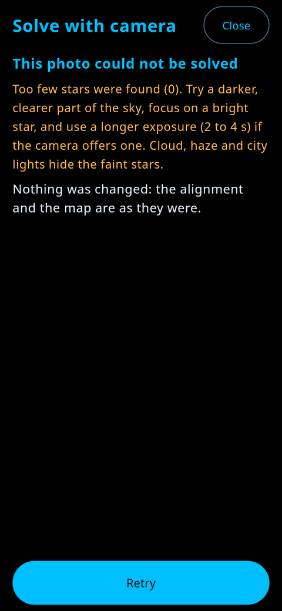 | 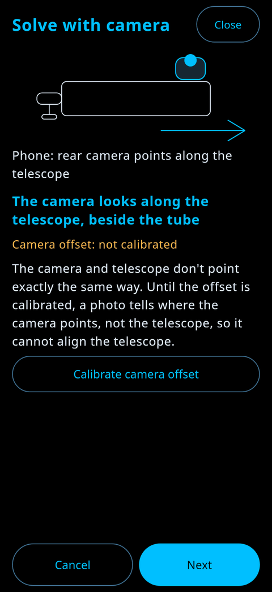 | 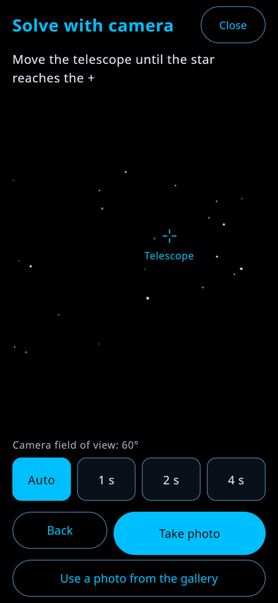 |

- **A failed photo changes nothing.** The app says why (too few stars, too bright, trailed stars, no match) and what to try.
- **Camera along the tube** (placement B): calibrate the offset once. Pick a star, centre it in the eyepiece, take a photo, and save the offset. Until then the photo tells where the camera points, not the telescope.
- **Flat on the tube** (placement A): the camera sees the tube, so there is nothing to solve. The app offers to change the placement.
- **Photos are never saved or sent anywhere.** They stay in memory while the app works on them.
- This has only been tested on simulated star photos. Your real-sky results are the most valuable thing you can send us.

## More to explore

The rest of the app works without a telescope too, so try it from your sofa first.

| Events | Time travel | Night mode |
| :-: | :-: | :-: |
| 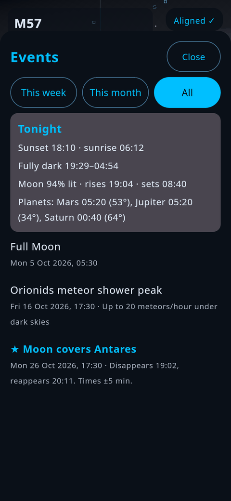 | 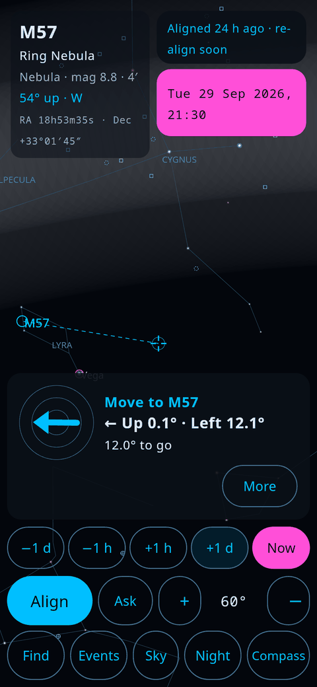 | 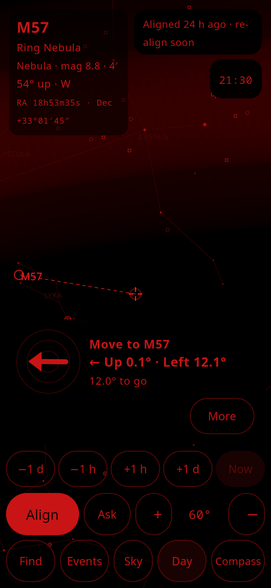 |

- **Events** lists the next 60 days: Moon phases, eclipses, meteor showers, conjunctions, transits, occultations, bright comets and space-station passes, all worked out on the phone. Tap one to see the sky at that moment.
- **Time travel**: tap the clock to step the sky by hours or days. The clock turns pink while you are away from the present; **Now** brings you back.
- **Night** turns everything red to protect your dark adaptation. Turn the screen brightness down too.
- **Ask** is an offline voice helper: tap it and say "find Jupiter" or "what is M31".
- **My objects and watch lists**: add your own targets by RA and Dec, and step through a list with ‹ and › during a session.
- **Help** in the app has a short page on every feature, plus the licences.

## Troubleshooting

| Problem | Likely cause | What to do |
| --- | --- | --- |
| The map does not match the sky when you hold the phone up | Location off, or the compass needs calibrating | Allow location. Wave the phone in a figure of eight away from metal. Then align on a star; alignment matters more than the compass. |
| The arrows lead you the wrong way | Wrong phone edge or eyepiece setting | Run **Check orientation → Check the phone position**. Newtonian owners: the eyepiece is a right angle. |
| Arrows were right, then drift off | Sensors drift over minutes, or the phone moved in its holder | Re-align on a bright star near each new target. Tighten the holder. |
| "Correction" after Confirm is very large | The star in the eyepiece is not the one you tapped | Check you centred the right star, then **Retry**. |
| The target is close but not in the eyepiece | Eyepiece field is small, or focal lengths are wrong | Use your lowest-power eyepiece. Enter the telescope and eyepiece focal lengths in **Telescope & orientation**. |
| Up and left in the eyepiece feel reversed | The eyepiece view is turned or mirrored | Run **Check the eyepiece view**, then turn on **Match eyepiece view**. |
| Camera photo: "too few stars" | Too short, too bright or out of focus | Darker part of the sky, focus on a bright star, try 2 s or 4 s. |
| Camera photo: "trailed stars" | The telescope or phone moved during the photo | Hands off the telescope while it takes the photo; use a shorter exposure. |
| Camera: Apply is greyed out | Gallery photo, phone moved, or beside-the-tube offset not calibrated | Retake the photo with the phone still; calibrate the offset if the camera is beside the tube. |
| A new build will not install | It was signed with a different key | Uninstall AstroFixxer first (this erases your lists), then install. |
| Space-station passes are missing | Orbit data is old and you are offline | Open the app once with internet; it refreshes them at most once a day. |

## What to test and how to report it

One evening with the checklist below tells us more than a month of computer tests. You do not need to do all of it.

At home, before the night:

- [ ] Install the app and finish the setup wizard for your telescope.
- [ ] Hold the phone up at the sky (Compass mode): planets and bright stars land within a few degrees of the real ones.
- [ ] Events shows tonight's Moon phase and any meteor shower peak.
- [ ] Airplane mode: everything except the orbit refresh and the update check still works.
- [ ] **Sky & viewing → More → App updates → Check for updates** works and says what it found.

At the telescope:

- [ ] Align on a bright star, then find 5 to 10 targets, each with an alignment star 5 to 20° away. Time each one; stop at 5 minutes (a miss). Good autumn targets: M13, M57, M27, M31, M11, M15, M2, M92.
- [ ] Run both orientation checks and note what they said.
- [ ] Camera on the eyepiece: centre a known star, take a photo with **Auto**, then 1 s, 2 s and 4 s if offered. Note solved or not, the time, and whether **Apply** gives "On target".
- [ ] Camera beside the tube (if you can): calibrate the offset first, then the same as above.
- [ ] The camera permission is asked only when the live view opens, and nothing is saved to your gallery.
- [ ] Battery use over one hour at night brightness.

For each target, a line like this is perfect:

| Phone | Telescope | Align star | Target | Distance (°) | Time (s) | Found? | Notes |
| --- | --- | --- | --- | --- | --- | --- | --- |
| Example: Pixel 7 | 8" Dobsonian | Vega | M57 | 8 | 45 | Yes | Arrow was left when it should have been right at first |

**How to report.** Open an issue at [github.com/Zenithquonta/astrofixxer-android/issues](https://github.com/Zenithquonta/astrofixxer-android/issues), or send your notes to the person who invited you. Please include:

- your phone model and Android version;
- your telescope type and how the phone was fixed (A, B or C);
- what you did, what you expected, and what happened;
- a screenshot, and for camera problems the error message.

Do not put private information in a public issue. Thank you for testing, and clear skies.
